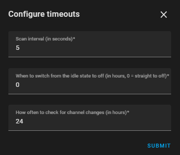

# Virgin Media TV

Home Assistant integration for Virgin Media TV.

# Description

This integration is intended to work with Home Assistant to provide the 
ability to control the STB devices and provide access to the TV listings for 
your area.

> I do not have access to the TV360 platform, so I'm pretty sure control of 
the STB will not currently work (this implementation currently uses the RAW 
protocol provided by TiVo for the V6 platform - but can be extended to 
accommodate the TV360 platform in the future).

# Installation

## HACS

The prefered method of installation is to use HACS. Ensure that you add this 
repository URL to the custom repository list.

## Manual

If you'd prefer to manually add this integration then ensure that all files 
and folders from the `custom_components/virginmedia_tv` folder are copied to 
your `config/custom_components` folder.

# Setup

The integration will automatically detect any V6 STB devices on the network 
if you have `zeroconf` configured in your HASS installation. 

If you decide to add an STB device manually, you will be prompted for the IP 
address and port number.

After this point the two setup routines are the same.

- `Retrieve your available channels` - when selected the channels available 
  to you will be retrieved from the Virgin Media online TV listings.

  **N.B.** This option requires that you enter your Virgin Media credentials 
  in a subsequent screen

- `Use media browser instead of source list for channel display` - when 
  selected the media_player entity will use the media browser component for 
  displaying 
  TV channels. If not selected the list of sources will be used.

If you previously selected to retrieve channels then you will need to enter 
your Virgin Media credentials.

- `Scan interval (in seconds)` - how often to check for changes on the STB.
- `When to switch from the idle state to off (in hours, 0 = straight to off)` -
  by setting a value the media_player entity will use the idle state if it 
  is unable to retrieve a channel number from the STB. After the given 
  period of time it will switch off.
- `How often to check for channel changes (in hours)` - after the given 
  period the channel list will be refreshed.

Clicking `Finish` will complete the integration setup.

## Entities Created

#### Media Player
This is the main entity and can be used for controlling the STB including 
channel changes (by either the source list or media browser depending on 
your configured options).

#### Sensor
Disabled by default, the sensore created holds the software version 
installed on the STB.

## Services

- `Virgin Media TV: Send IR Code` - allows you to send an IR code to an STB.
- `Virgin Media TV: Send Key Code` - allows you to send a key code to an STB. 

For both services the STB is selectable and a suggestion list of the 
available codes is provided.

# Configurable Options

All the options can be reconfigured once the integration has been created. 
There are some additional steps in this flow though.

The options here allow you to switch between the available STB platforms. 

> Whilst both TV360 and V6 are shown, controlling a TV360 STB is not 
> currently supported. At present this option only affects the processing of 
> the channel listing.

If you had previously configured to retrieve channel listings but later 
decide that you do not want to do this anymore, deselecting the option 
results in the following: -

- `Clear the credentials from the cache` - selecting this option will remove 
  the credentails from the configured integration and will also remove any 
  cached tokens.
- `Clear the channel and show information from the cache` - selecting this 
  option will remove the channel listing and any cached guide information.

If you have multiple STB devices configured these will be listed, and you'll 
need to confirm that you'd like to clean the cache. The cache is shared 
across the configured STB devices so clearing when configuring one of them 
may cause the other integration to re-authenticate and re-cache the 
necessary information.

The timeouts screen will only show those timeouts that are relevant to your 
selections - notice in this case the timeout for channel retrieval is no 
longer presented.

### Re-enabling or re-configuring channel retrieval/region

If you had previously disabled channel retrieval or are looking to change 
the channel region then ensure the channel retrieval is selected in the 
options screen.

You will be prompted to re-enter your credentials (depending on whether 
these were removed from the cache or never there in the first place) they 
may already be pre-filled.

You will be prompted for the region that best suits your location. These 
regions are as per TV Channel Lists.

# Channel Listing Process

For the TV360 platform channel listings can be taken directly from the 
Virgin TV Go platform. This is not the case for the V6 platform. The V6 
platform still provides different channel numbers for the HD and SD channels.

To take that into account the TV Channel Lists site is used to scrape the 
details of the various regions, to ensure the correct details are provided. 
This is then parsed and merged in with the details provided by the Virgin TV 
Go platform.

# Thanks
The inspiration for this integration has come from the following places (and 
the fact that Logitech have decided to discontinue their remote controls, so 
I decided to investigate other options): -

https://github.com/bertbert72/HomeAssistant_VirginTivo

https://github.com/Sholofly/ziggonext-python

